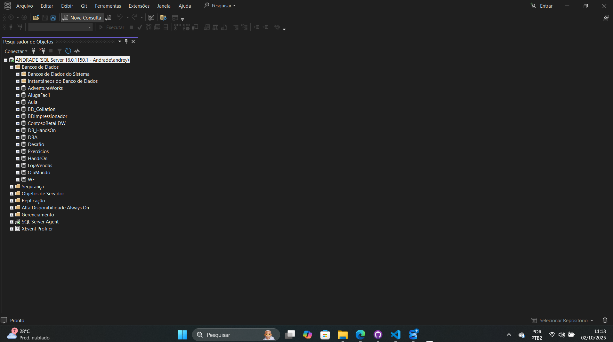

# Projeto 2 - Gerenciamento de Arquivos de Dados no SQL Server

Este repositório faz parte do meu portfólio como **DBA Júnior**, demonstrando habilidades práticas de **administração física de bancos de dados** no **SQL Server**, com base nos conteúdos do **Módulo 2** do curso de SQL Server.

---

## 🎯 Objetivo

Demonstrar na prática como um **DBA Júnior** gerencia arquivos de dados e log de um banco de dados, incluindo:

- Criação de banco de dados com parâmetros personalizados;
- Aumento manual de arquivos (.mdf e .ndf);
- Redução de tamanho de arquivos e liberação de espaço;
- Movimentação física de arquivos de dados e log.

---

## 🧠 Conceitos Aplicados neste Projeto

Durante este projeto foram aplicados conceitos fundamentais sobre **estrutura física e lógica** do SQL Server.

### 🧩 Estrutura Física

O SQL Server utiliza três tipos de arquivos principais:
- **.MDF (Primary Data File)** → Armazena os dados principais do banco.  
- **.NDF (Secondary Data File)** → Armazena dados adicionais, podendo ser distribuído em outros discos.  
- **.LDF (Transaction Log File)** → Armazena o log de transações para recuperação de dados.

### 💽 Filegroups
Os **Filegroups** são agrupamentos lógicos de arquivos físicos, permitindo maior controle sobre desempenho e armazenamento.  
Por padrão, todos os bancos possuem o **PRIMARY FILEGROUP**.

### ⚙️ Configuração de Crescimento
Cada arquivo pode ter parâmetros definidos como:
- **SIZE:** tamanho inicial do arquivo.  
- **MAXSIZE:** tamanho máximo permitido.  
- **FILEGROWTH:** tamanho do crescimento automático.

### 🔁 Verificação de Espaço e Redução
Comandos úteis utilizados neste projeto:
```sql
DBCC SHRINKDATABASE('DatabaseName', target_percent);
DBCC SHRINKFILE('LogicalFileName', target_size_MB);
```

### 📂 Movimentação de Arquivos
Para mover arquivos de banco com segurança:
1. Identificar os nomes físicos (`sys.master_files`);  
2. Colocar o banco em **OFFLINE**;  
3. Alterar o caminho com `ALTER DATABASE MODIFY FILE`;  
4. Mover o arquivo fisicamente;  
5. Colocar o banco em **ONLINE** novamente.

---

## 🖥️ Ambiente Utilizado
- **SQL Server 2022 Developer Edition**  
- **SQL Server Management Studio (SSMS)**  
- **Sistema Operacional:** Windows 11  

📌 *Screenshot do ambiente:*



---

## 📂 Estrutura do Projeto

```
📁 Projeto2-GerenciamentoArquivos
┣ 📂 imagens/                  # Capturas de tela do SSMS
┣ 📂 scripts/                  # Scripts SQL utilizados no projeto
┃ ┣ 📜 01_criacao_banco.sql    # Criação de banco com parâmetros de tamanho e crescimento
┃ ┣ 📜 02_aumentar_arquivo.sql # Aumento e adição de novos arquivos (.ndf)
┃ ┣ 📜 03_reduzir_arquivo.sql  # Redução do tamanho e liberação de espaço
┃ ┗ 📜 04_mover_arquivos.sql   # Movimentação física de arquivos (.ldf e .mdf)
┣ 📜 README.md                 # Documentação do projeto
```

---

## ▶️ Como Executar

1. Abra o **SQL Server Management Studio (SSMS)**;  
2. Conecte-se ao servidor SQL Server;  
3. Execute os scripts na seguinte ordem:  
   - `01_criacao_banco.sql`  
   - `02_aumentar_arquivo.sql`  
   - `03_reduzir_arquivo.sql`  
   - `04_mover_arquivos.sql`  
4. Verifique o resultado em **Object Explorer** e confirme as alterações aplicadas aos arquivos.

---

## 📊 Resultados Esperados

- Banco criado com configuração de armazenamento personalizada;  
- Arquivos de dados ampliados e distribuídos entre unidades;  
- Redução eficiente de espaço físico com `DBCC SHRINK`;  
- Movimentação bem-sucedida de arquivos `.ldf` e `.mdf` entre diretórios.

---

## 🔜 Próximos Passos

- Criar **filegroups personalizados** e associar tabelas específicas;  
- Implementar **estratégias de crescimento automático** otimizadas;  
- Simular cenários de **recuperação de banco** após falhas;  
- Monitorar uso de disco com **DMVs do SQL Server**.

---

## 📌 Observações

Este projeto faz parte do portfólio técnico do **Módulo 2 - Banco de Dados**,  
demonstrando práticas reais de **administração de arquivos físicos** and configuração de desempenho no SQL Server.

---

✉️ *Autor:* [Andrey Andrade](https://github.com/andrey22andrade)
